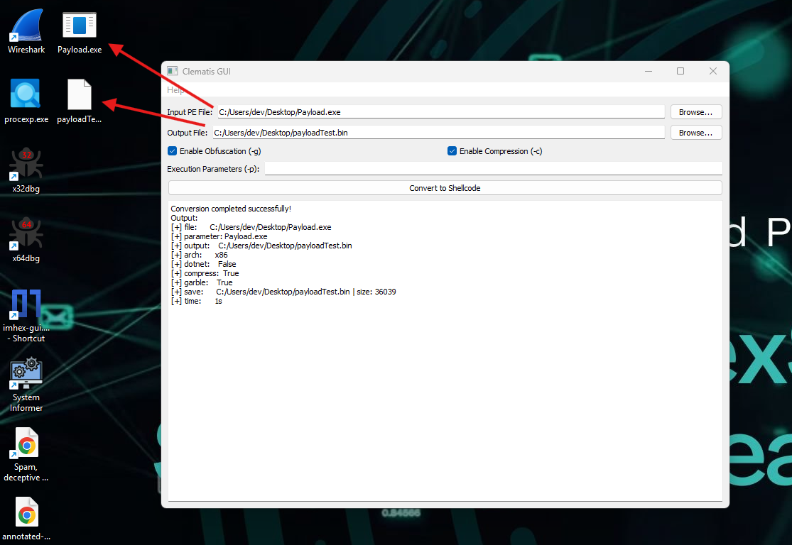

# Clematis - PE to Shellcode Converter


## What is Clematis?
Clematis is a sophisticated tool designed to transform PE (Portable Executable) files into position-independent shellcode. This conversion process enables the execution of PE files directly in memory, bypassing traditional file-based execution methods. The tool supports both x86 and x64 architectures and can handle various types of PE files, including executables (.exe) and dynamic link libraries (.dll).

### Key Capabilities
- Converts PE files to position-independent shellcode
- Supports both x86 and x64 architectures
- Handles various PE file types (EXE, DLL, .NET, Go)
- Integrates command-line arguments into the shellcode
- Provides obfuscation capabilities for enhanced stealth
- Implements LZNT1 compression for reduced shellcode size
- Ensures proper memory cleanup after execution

## Command Line Usage
The tool can be used through the command line with the following syntax:

```bash
python clematis.py -f <input_file> -o <output_file> [options]
```

### Required Arguments
- `-f, --file`: Path to the input PE file
- `-o, --output`: Path to save the output shellcode

### Optional Arguments
- `-g, --garble`: Enable obfuscation (default: True)
- `-c, --compress`: Enable compression (default: True)
- `-p, --parameter`: Execution parameters to pass to the PE file

### Example Usage
```bash
# Basic conversion
python clematis.py -f example.exe -o output.bin

# Conversion with parameters
python clematis.py -f example.exe -o output.bin -p arg1 arg2 "argument 3"

# Disable obfuscation and compression
python clematis.py -f example.exe -o output.bin -g false -c false
```

## Features
- Support for x86 and x64 architectures
- Command-line argument support
- Obfuscation for enhanced stealth
- LZNT1 compression algorithm
- Automatic memory cleanup
- Support for both executable files (.exe) and libraries (.dll)
- Support for .NET and Go applications

## GUI Version
The project now includes a user-friendly graphical interface (GUI) built with PyQt5 that provides an intuitive way to use Clematis. The GUI includes:
- File selection fields with browse buttons for input PE file and output file
- Checkboxes for enabling/disabling obfuscation (-g) and compression (-c)
- Input field for execution parameters (-p)
- Real-time conversion status and output display
- Clear success/failure feedback
- Architecture detection (x86/x64)
- File size information

### GUI Features
- Input PE file selection
- Output file specification
- Obfuscation toggle (-g)
- Compression toggle (-c)
- Execution parameters input (-p)
- Detailed tooltips explaining each option
- Comprehensive help menu with program information

## Installation
1. Clone the repository:
```bash
git clone https://github.com/hexsecteam/clematis.git
cd clematis
```

2. Install dependencies:
```bash
pip install -r requirements.txt
```

3. Run the GUI:
```bash
python clematis_gui.py
```

As shown in the screenshot, the GUI includes:


The project now includes a user-friendly graphical interface (GUI) built with PyQt5 that provides an intuitive way to use Clematis. The GUI includes:
- File selection fields with browse buttons for input PE file and output file
- Checkboxes for enabling/disabling obfuscation (-g) and compression (-c)
- Input field for execution parameters (-p)

## About HexSec Team
 Welcome to HexSec – The Future of Software Protection & Cybersecurity!

We specialize in advanced encryption, software security, and penetration testing. Our research explores crypters, AV bypass techniques, malware obfuscation, botnet development, keyloggers, RATs (Remote Administration Tools), and advanced reverse engineering to push the boundaries of cybersecurity.

🔥 What We Do:

✔ Custom Crypters & FUD Encryption – Protecting software from detection.

✔ Advanced Malware Analysis & Reverse Engineering – Understanding and improving stealth techniques.

✔ Botnet & RAT Development – Researching secure and efficient remote administration methods.

✔ AV Evasion & Red Teaming Research – Testing and enhancing security defenses.

✔ Exclusive Security Tools & Development – Crafting next-gen cybersecurity solutions.

### Social Media
- Vimeo: [https://vimeo.com/hexsec](https://vimeo.com/hexsec)
- Dailymotion: [https://dailymotion.com/hexsectools](https://dailymotion.com/hexsectools)
- Medium: [https://medium.com/@hexsectools](https://medium.com/@hexsectools)
- Facebook: [https://www.facebook.com/hexsexcommunity/](https://www.facebook.com/hexsexcommunity/)
- YouTube: [https://www.youtube.com/@hex_sec](https://www.youtube.com/@hex_sec)

### Contact
For more details, contact us on Telegram: @hexsecteam

## Disclaimer
This software is provided "as is" without any warranty. Use at your own risk. For educational purposes only. The authors are not responsible for any misuse or damage caused by this tool. Users must comply with all applicable laws. 

## Original Project
Clematis is a powerful tool that converts PE (Portable Executable) files into position-independent shellcode. The original project can be found at: [GitHub Repository]([https://github.com/hexsecteam/clematis](https://github.com/CBLabresearch/clematis/blob/main/readme.md))
