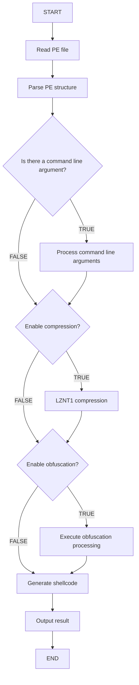

# Clematis


[ [中文](https://github.com/CBLabresearch/clematis/blob/main/readme_ch.md) | [English](https://github.com/CBLabresearch/clematis/blob/main/readme.md) ]

🛠️ A powerful tool for converting PE files (EXE/DLL) into position-independent shellcode.

## ✨ Key Features

- Support for converting PE files (EXE/DLL) to shellcode
- Compatible with both x86 and x64 architectures
- Command-line argument support
- Built-in LZNT1 compression algorithm for significant output file size reduction
- Optional obfuscation for enhanced stealth

## 📦 Installation

### Dependencies
```bash
pip install pefile lznt1
```

## 🚀 Usage

```bash
python clematis.py -f <PE_file> -o <output_file> [-g <true/false>] [-c <true/false>] [-p <parameters>]
```

### Parameters

|        |                 | desc                                        | default | required |
|--------|-----------------|---------------------------------------------|---------|----------|
| **-f** | **--file**      | Path to the PE file to convert              |         | true     |
| **-o** | **--output**    | Output filename                             |         | true     |
| **-g** | **--garble**    | Enable obfuscation                          | true    | false    |
| **-c** | **--compress**  | Enable compression                          | true    | false    |
| **-p** | **--parameter** | Execution parameters to pass to the PE file |         | false    |

### Examples

```bash
# Show help information
python clematis.py -h

# Basic usage
python clematis.py -f target.exe -o output.bin

# Disable obfuscation and compression
python clematis.py -f target.exe -o output.bin -g false -c false

# Pass arguments to target program
python clematis.py -f target.exe -o output.bin -p arg1 arg2

python clematis.py -f target.exe -o output.bin -p "arg1 arg2"
```

## 💪 Our Advantages

- 🎯 Support for DOT NET
- 🗜️ Compression support
- 🎭 Obfuscation support
- 🔄 Parameter passing support
- 🚀 Full support for golang
- 💪 Generated shellcode is powerful and stable

## 💡 Design Philosophy

##### In certain special environments, we may encounter the following challenges:

```text
- 🛡️ Unable to perform process injection (AV/EDR/XDR blocking)
- 🔄 Executing golang programs in current process may cause blocking
- 💾 Memory leaks may occur after golang program execution
- ⚠️ Threads created by golang cannot be released!
```

##### To address these issues, we developed clematis:

```text
- ✨ Convert golang programs to shellcode
- 🎯 Direct execution in current process
- ♻️ Automatic memory release after execution
- 🚀 Completely avoid golang-related memory issues
- 🔄 Reclaim all threads created by golang
```

## 📝 Notes

- Ensure sufficient permissions to read source PE files and write target files
- Compression is recommended when converting large files
- Obfuscation may add some performance overhead but provides better stealth

## ⚠️ Known Issues

- Parts of an application (exe) built with mingw | gcc may fail to load, it may be caused by relocation? ( Not implemented )
- DOT NET illegal memory access ( Fixed )

## 🗓️ Planned Features

- Advanced encryption options for better security
- GUI interface for easier operation
- Real-time conversion progress monitoring
- Processing of resources in PE
- Enhanced evasion capabilities, such as [ProxyDll, Syscall, ...]

## 🔄 Recent Updates

- 2024-12-27
    - Support for DOT NET (x64 | x86)

- 2024-12-28
    - Fixed potential DOT NET program crashes (May not occur)
    - Added handling for IMAGE_DIRECTORY_ENTRY_EXCEPTION ( x64 )
    - Updated APIs to use NTAPI

        | before | now |
        | --- | --- |
        | `VirtualAlloc` | `NtAllocateVirtualMemory` |
        | `VirtualProtect` | `NtProtectVirtualMemory` |
        | `VirtualFree` | `NtFreeVirtualMemory` |
        | `LoadLibrary` | `LdrLoadDll` |
        | `GetProcAddress` | `LdrGetProcedureAddress` |
        | `WaitForMultipleObjects` | `NtWaitForMultipleObjects` |
        | `CreateEvent` | `NtCreateEvent` |
        | `CloseHandle` | `NtClose` |
        | `SignalObjectAndWait` | `NtSignalAndWaitForSingleObject` |
        | `TerminateThread` | `NtTerminateThread` |
        | `SuspendThread` | `NtSuspendThread` |
        | `OpenThread` | `NtOpenThread` |
        | `ResumeThread` | `NtResumeThread` |
        | `GetContextThread` | `NtGetContextThread` |
        | `SetContextThread` | `NtSetContextThread` |
        | ... |

- 2025-1-1
    - Added thread safety for managing thread lists and memory lists
    - Fix some functional issues
    - Remove parameter processing in payload and change to patch
    - Support for upx
    - Add architecture check in the payload to check whether the architecture matches
    - Some implementations have been changed to provide better compatibility

---

## ⚠️ Warning
- We are not planning to release this update for free, we will put it in our paid circle.
- This project continues to be available and free, but may not be updated in the future, thank you!


---

## 🔍 How It Works

Clematis converts PE files to shellcode through the following steps:

1. Read and parse target PE file
2. Process command line arguments (if any)
3. Optional LZNT1 compression
4. Optional obfuscation processing
5. Generate final position-independent shellcode



---

## 🤝 Contributing

Issues and Pull Requests are welcome!

